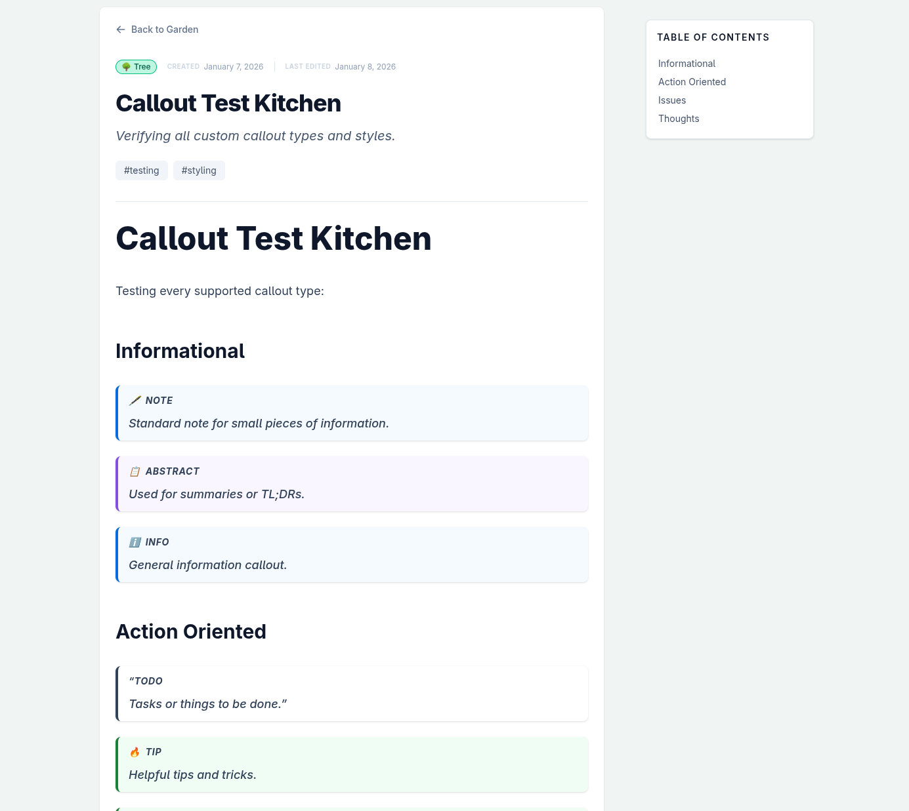
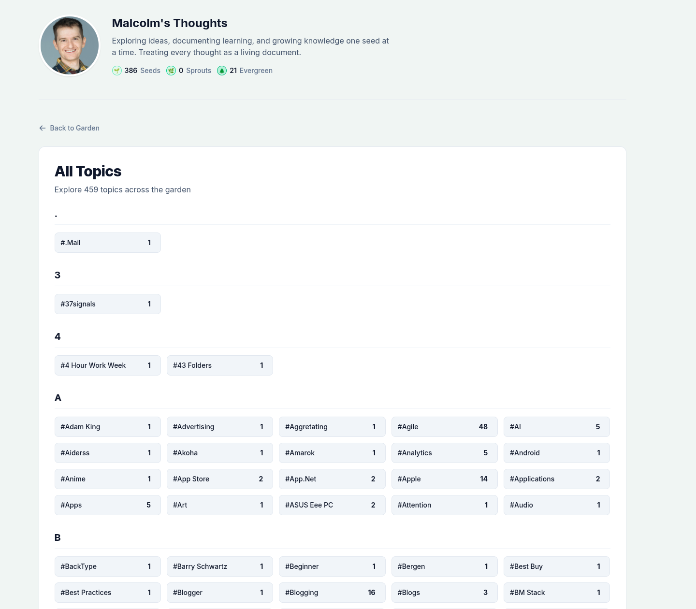

# 🌿 Sprout: An Evolving Digital Garden

Sprout is a modern, feature-rich digital garden built with **Astro** and **Tailwind CSS**.
It treats thoughts as living documents, tracking their evolution through Git history while providing
a delightful reading and discovery experience with advanced filtering, SEO optimization, and interactive features.

## Screenshots

### Homepage (Light Mode)


### Homepage (Dark Mode)


### Post Page


### About Page


### Topic Index


### Site Footer & Stats


## ✨ Key Features

### **📚 Content Management**
- **🌱 Growth States:** Categorize your thoughts as **Seed**, **Sprout**, or **Evergreen** to reflect their maturity.
- **📌 Pinned Posts:** Highlight foundational thoughts at the top of your homepage for easy access.
- **🌟 Featured Posts:** Make significant posts stand out in the timeline with larger cards and cover images.
- **🏷️ Flexible Tagging:** Support for both frontmatter tags and inline `#hashtag` style tagging within your content.
- **📖 Reading Time Estimates:** Automatic calculation of estimated reading time for each post.
- **🔗 Backlinks:** Automatic tracking of connections between your thoughts, showing every other post that links to the current one.
- **📋 Table of Contents:** Auto-generated navigation for posts with multiple headings (desktop only).
- **🏗️ Drafting System:** Support for marking entire posts or specific blocks as in-progress with unique "under construction" styling.

### **🔍 Discovery & Navigation**
- **🗺️ Content Map:** A unique visual header on every post page that visualizes the structure (headers, callouts, paragraphs) and provides a sense of length and landmarks.
- **☀️ Freshly Planted:** A dedicated homepage section to quickly surface your most recent updates and new seeds.
- **🔍 Post Search:** Instant, full-text client-side search to help visitors find specific thoughts.
- **📂 Topic Index:** A comprehensive page listing all garden topics with post counts for easy exploration.
- **🔗 Smart Link Detection:** Visual distinction between internal wiki-links and external references, including "link distinction" styling.
- **📅 Post Timeline:** A chronological overview of your garden's activity, showing when posts were created or updated.
- **📅 Date Filtering:** Click any active day in the activity heatmap to filter posts by creation/update date.

### **🎨 Design & UX**
- **📖 Enhanced Core Pages:** Polished **About** and **Colophon** pages to share your personal story and the technical stack behind your garden.
- **📝 Semantic Callouts:** Rich support for GitHub-style alerts and custom garden callouts like `[!IDEA]`, `[!QUESTION]`, and `[!DRAFT]`.
- **🌓 Adaptive Themes:** Green-tinted light and dark modes with a persistent toggle.
- **🎨 Centralized Theme System:** All colors managed in a single configuration file for easy customization.
- **📱 Responsive Design:** Optimized layouts for all device sizes with mobile-first approach.

### **🔧 Technical Features**
- **📜 Git Evolution Tracking:** Automatically extracts file history from Git to show a timeline of how each post has grown.
- **📊 Activity Heatmap:** A GitHub-style contributions grid showing when you've been tending to your garden.
- **🔍 SEO Optimized:** Structured data (JSON-LD), meta tags, Open Graph, Twitter Cards, sitemap, and robots.txt.
- **⚡ Performance:** Fast builds, optimized images, and efficient client-side filtering.
- **✨ Local Support & Sharp Optimization:** Optimized local development experience with image processing powered by Sharp.

## 🚀 Getting Started

### Prerequisites
- Node.js (v20 or higher)
- Git

### Setup

1. **Clone this repository:**
    ```sh
    git clone https://github.com/yourusername/your-garden-repo.git
    cd your-garden-repo
    ```

### Local Development

1. **Install all required packages:**
   ```sh
   npm install
   ```
   *This command reads `package.json` and automatically installs Astro, Tailwind CSS, and all necessary plugins.*

2. **Start the development server:**
   ```sh
   npm run dev
   ```

3. **Open the garden:**
   Navigate to `http://localhost:4321` in your browser.

## ✍️ Creating New Posts

Posts are located in `src/content/posts/`. To create a new one, add a `.md` file:

```markdown
---
title: "My New Discovery"
status: "seed" # seed | sprout | tree
tags: ["learning", "webdev"]
summary: "A brief sentence describing this thought."
# publishedDate: 2026-01-08 (Optional - will fallback to Git creation date)
# draft: true (Optional - adds a WIP banner)
---

# My New Discovery

Your content here...

> [!IDEA]
> What if everything was a garden?
```

## 🛠️ Project Structure

- `src/content/`: Your blog posts and collection configuration.
- `src/components/`: Reusable UI elements (Heatmap, Content Map, Table of Contents, Toggle, etc.).
- `src/layouts/`: Page wrappers (Main Layout and Post Layout).
- `src/lib/`: Backend utilities (Git history extraction, theme configuration, and Remark plugins).
- `src/styles/`: Global Tailwind CSS and custom theme configurations.
- `public/`: Static assets including robots.txt and favicon.

## 🎨 Customization

### **Theme Configuration**
All colors are centralized in `src/lib/theme.ts` for easy customization:

```typescript
export const theme = {
  status: {
    seed: {
      badge: 'bg-emerald-100 dark:bg-emerald-800/40 text-slate-600 dark:text-slate-400 border-emerald-300 dark:border-emerald-900',
      glow: 'hover:shadow-emerald-200/50 dark:hover:shadow-emerald-900/50',
      progress: 'bg-emerald-300 dark:bg-emerald-800'
    },
    // ... sprout and tree configurations
  },
  // ... header and other theme settings
};
```

### **Post Frontmatter Options**
```markdown
---
title: "My Post Title"
status: "seed"        # seed | sprout | tree
tags: ["tag1", "tag2"]
summary: "Brief description"
publishedDate: 2026-01-08  # Optional, defaults to Git creation date
draft: true              # Optional, adds WIP banner
---
```

## 🚢 Deployment

This project is configured for **GitHub Pages** via GitHub Actions. Any push to the `main` branch will automatically build and deploy the site.

### **SEO & Performance**
- **Automatic Sitemap:** Generated at `/sitemap-index.xml` with proper priorities and change frequencies
- **Robots.txt:** Configured for optimal crawling
- **Structured Data:** JSON-LD schema markup for blog posts
- **Meta Tags:** Complete Open Graph and Twitter Card support
- **Performance:** Optimized builds with efficient client-side filtering

### **Analytics & Monitoring**
The site is ready for analytics integration (Google Analytics, Plausible, etc.) and includes proper meta tags for social media sharing.

## 🤝 Contributing

This digital garden is designed to grow organically. Feel free to:
- Create new posts in `src/content/posts/`
- Customize colors in `src/lib/theme.ts`
- Add new features or improve existing ones
- Share your gardening techniques!

## 📈 Future Plans

- RSS feed generation
- Comment system integration
- Advanced search with fuzzy matching
- Post series/collections support
- Export functionality (PDF, EPUB)
- Multi-author support

---
*Happy gardening!* 🌿
